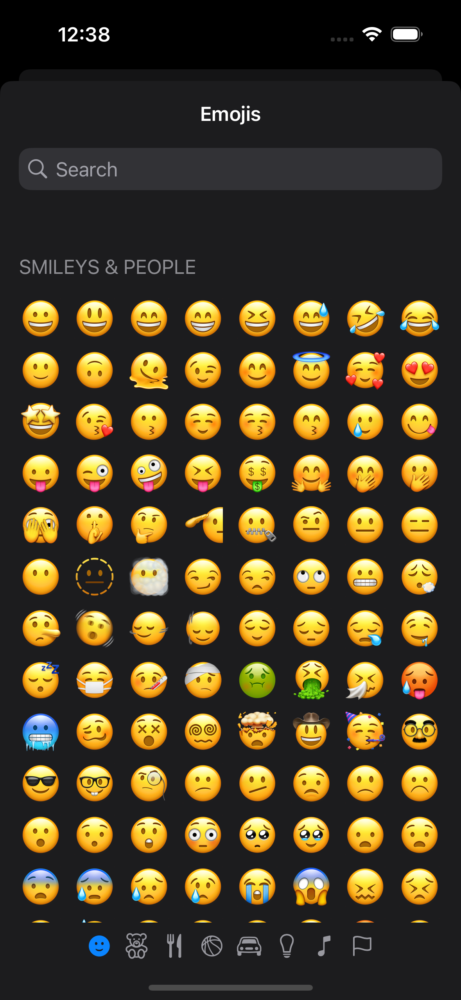
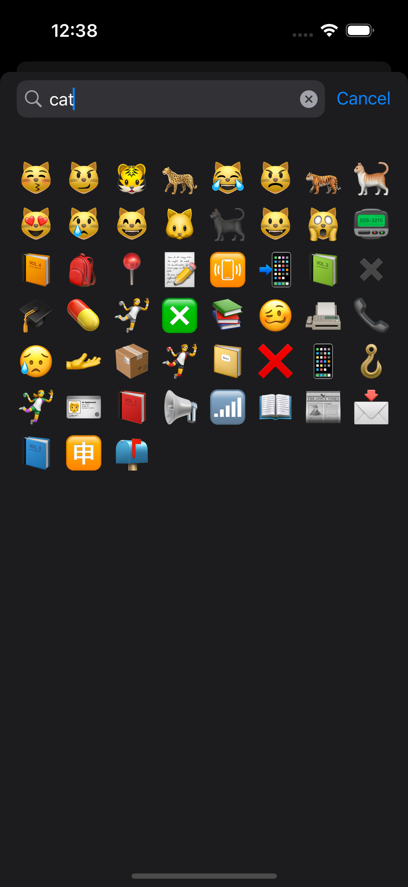

# EmojiPicker

This Swift package allows you to show a view with all available emoji on the OS, navigate through the list of emojis and categories, search for emojis based on keywords, and select an emoji.

## Screenshots

|Emoji list|Emoji search|Emoji settings|
|---|---|---|
||||

## Dependencies

- SwiftUI (iOS >= 15.0)
- [EmojiKit](https://github.com/tyiu/EmojiKit) (0.2.0)
- [SwiftTrie](https://github.com/tyiu/swift-trie) (0.1.2)

## Installation

EmojiPicker can be integrated as an Xcode project target or a Swift package target.

### Xcode Project Target

1. Go to `File` -> `Add Package Dependencies`.
2. Type https://github.com/tyiu/EmojiPicker.git into the search field.
3. Select `EmojiPicker` from the search results.
4. Select `Up to Next Major Version` starting from the latest release as the dependency rule.
5. Ensure your project is selected next to `Add to Project`.
6. Click `Add Package`.
7. On the package product dialog, add `EmojiPicker` to your target and click `Add Package`.

### Swift Package Target

In your `Package.swift` file:
1. Add the EmojiPicker package dependency to https://github.com/tyiu/EmojiPicker.git
2. Add `EmojiPicker` as a dependency on the targets that need to use the SDK.

```swift
let package = Package(
    // ...
    dependencies: [
        // ...
        .package(url: "https://github.com/tyiu/EmojiPicker.git", .upToNextMajor(from: "0.2.0"))
    ],
    targets: [
        .target(
            // ...
            dependencies: ["EmojiPicker"]
        ),
        .testTarget(
            // ...
            dependencies: ["EmojiPicker"]
        )
    ]
)
```

## Usage

Import `EmojiPicker` in the file you want to use it in:

```swift
import EmojiPicker
```

Then add `EmojiPickerView` as a view. Here is a complete example:

```swift
import SwiftUI
import EmojiPicker
import EmojiKit

struct ContentView: View {

    @State
    var selectedEmoji: Emoji?

    @State
    var displayEmojiPicker: Bool = false

    var body: some View {
        VStack {
            VStack {
                Text(selectedEmoji?.value ?? "")
                    .font(.largeTitle)
                Text(selectedEmoji?.localizedKeywords["en"]?.joined(separator: ", ") ?? "")
                    .font(.title3)
            }
            .padding(8)
            Button {
                displayEmojiPicker = true
            } label: {
                Text("Select standard emoji")
            }
            .buttonStyle(.borderedProminent)
        }
        .padding()
        .sheet(isPresented: $displayEmojiPicker) {
            NavigationView {
                EmojiPickerView(selectedEmoji: $selectedEmoji)
                    .padding(.top, 32)
                    .navigationTitle("Emojis")
                    .navigationBarTitleDisplayMode(.inline)
            }
        }
    }

}
```

## Samples

You can access to sample project on folder `EmojiPickerSample`

## Acknowledgements

This Swift package was forked from [Kelvas09/EmojiPicker](https://github.com/Kelvas09/EmojiPicker).
